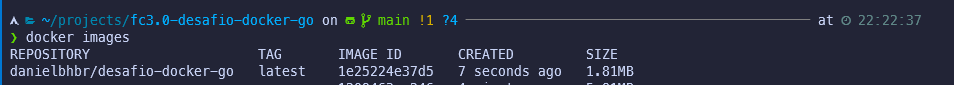
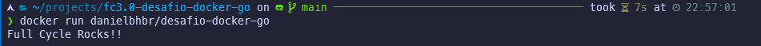

# Full Cycle 3.0 - Desafio Docker

Criar uma imagem Docker que execute um programa desenvolvido en GO Lang [https://golang.google.cn/] e que deverá escrever no **console** a frase *"Full Cycle Rocks!!"*.

A imagem final deverá ter o tamanho máximo de 2MB.

# Solução

O Dockerfile é organizado entre a criação de um runtime para o build do programa go, e uma segunda parte que é um runtime otimizado para executar o programa GO.

1. A imagem utilizada é ```FROM golang:latest as builder```
2. O arquivo ```go.mod``` define os módulo e a versão que o programa GO utilizará
3. A imagem de execução é ```FROM scratch``` que é uma imagem super otimizada para execução de binários [Imagem do Scratch](https://hub.docker.com/_/scratch)

4. Abaixo é possível visualizar o resultado após execução do comando ```docker run danielbhbr/desafio-docker-go```


# Endereço no Docker Hub

```sh
docker pull danielbhbr/desafio-docker-go
```
